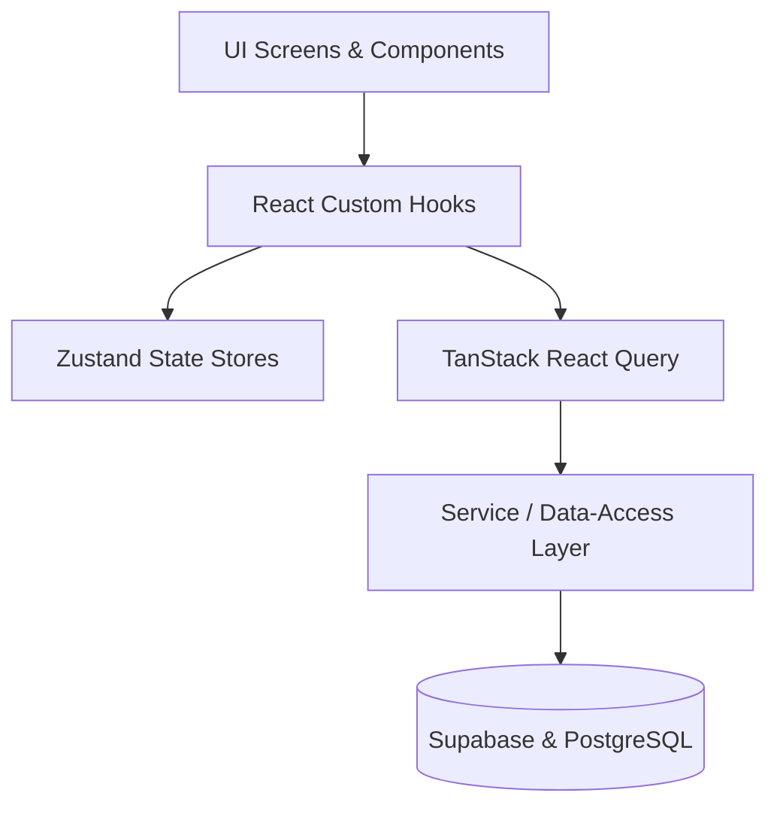

# Software Architecture — Bhel Puri

This document describes the architectural patterns and file layout used in the Bhel Puri MVP to ensure high scalability, security, and performance.

---

## 🏛️ Architectural Overview

Bhel Puri uses a **Feature-based Multi-tier Architecture** that keeps business logic cleanly separated from user interfaces.

### 1. Presentation Layer (UI Screens & Components)
- Screen routers are defined in `src/app/` using Expo Router.
- Base atomic elements are in `src/components/ui/` (stateless, highly reusable).
- Page-level or complex composite components reside inside feature folders (e.g., `src/features/auctions/components/`).

### 2. State & Hooks Layer
- **TanStack Query** manages server cache (auctions listings, active details, messages) and handles loading, error, and stale-while-revalidate states.
- **Zustand** manages lightweight global client-side state (current authenticated session, local preferences).
- **React Hook Form** handles validation schemas paired with Zod schemas.

### 3. Service Layer (Data Access)
- Located in `src/services/` (e.g., `auctionService.ts`, `profileService.ts`).
- **No direct Supabase queries inside components**: All interactions with Supabase are abstracted inside the service layer, making it easy to mock, test, or switch backend engines in the future.

---

## 🎨 Visual Design Integration

We use **NativeWind v4** to keep styling consistent with Tailwind CSS conventions.

1.  **Central Design System Tokens**: Spacing, custom color brandings, typography, and shadow offsets are defined in `src/design-system/theme.ts`.
2.  **Tailwind Configuration**: `tailwind.config.js` consumes these design system tokens, exposing custom classes like `bg-brand-primary` or `text-brand-text`.
3.  **Cross-Platform Harmony**: Tailwind compiled values render natively as React Native styles on iOS/Android, and compile to clean HTML styles on Web.

---

## ⚡ Performance Guidelines

To maintain premium, buttery-smooth interactions:
- **Image Optimization**: Always use `expo-image` instead of React Native's default `Image` for fast pre-fetching and caching.
- **List Rendering**: Prefer FlashList or FlatList over nested scrolls for infinite grids.
- **Animation Offloading**: All animations (transitions, press effects, countdown clocks) use **React Native Reanimated**, running directly on the native main thread to avoid blocking the JavaScript thread.
