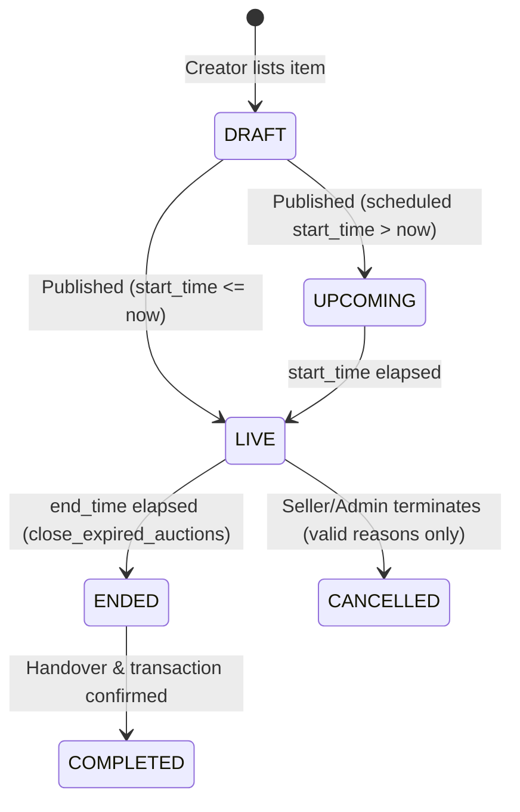

# Auction Rules Engine — Bhel Puri

This document outlines the authoritative rules, status transitions, and safety features built into the Bhel Puri auction engine.

---

## 🔁 Auction States

Auctions transition through explicit states. Status controls are managed on the database side:

-   **DRAFT**: The auction is being edited and is only visible to the seller.
-   **UPCOMING**: The listing is public, but bidding has not opened yet.
-   **LIVE**: The auction is active. Bids can be submitted.
-   **ENDED**: Bidding is closed. The winner and seller are determined.
-   **CANCELLED**: The auction was terminated by moderation or the seller before bids started.
-   **COMPLETED**: Transaction finalized. Buyer/seller ratings are eligible.

---

## ⚡ Bidding Validation Rules

When a user submits a bid via `place_bid(auction_id, bid_amount)`:

1.  **State check**: The auction status must be `LIVE` and the current time must be between `start_time` and `end_time`.
2.  **Seller check**: The bidder cannot be the creator/seller of the auction.
3.  **Initial bid value**: If there are no previous bids, the amount must be greater than or equal to the `starting_price`.
4.  **Increment threshold**: If there are existing bids, the amount must be greater than or equal to the `current_highest_bid` + the auction's `min_increment`.

---

## ⏱️ Anti-Sniping Protection

Sniping is the practice of placing a bid in the final seconds of an auction to prevent other buyers from reacting. Bhel Puri solves this with server-side timing extensions:

-   **Trigger Window**: **30 seconds** before the scheduled `end_time`.
-   **Rule**: If a valid bid is placed within the final 30 seconds of a live auction, the `end_time` is set to **30 seconds from the bid placement timestamp**.
-   **Effect**: Allows other participants 30 seconds to react and place counter-bids, ensuring fair market value.

---

## 🔒 Concurrency and Atomicity

To ensure that simultaneous bids do not create double entries or overwrite one another:
-   The `place_bid` PostgreSQL function acquires an exclusive row-level lock (`FOR UPDATE`) on the target row in the `auctions` table.
-   Subsequent concurrent transactions block until the active transaction completes or rolls back.
-   The verification of the highest bid, addition to the history table, and update of the parent auction occur in a single atomic transaction.
