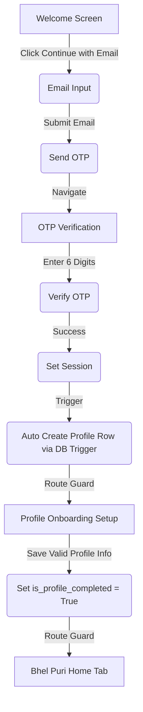

# Authentication & Navigation Flow — Bhel Puri

This document maps out the state machine, user routing paths, dynamic checks, and session restoration inside the Bhel Puri application.

---

## 1. Authentication State Machine
Central state is managed via [AuthContext.tsx](file:///Users/vikaspandey/Documents/Bhel%20Puri/src/lib/AuthContext.tsx) and maps the user to one of the following states:

1.  **`INITIALIZING`**: Session restoration is in progress. The application displays a premium loading screen; no screens are mounted.
2.  **`SIGNED_OUT`**: No session was found. User is redirected to `/welcome`.
3.  **`AUTHENTICATING`**: An OTP verification or Google OAuth sequence is executing.
4.  **`PROFILE_INCOMPLETE`**: Session is verified, but user has not finished onboarding (setting their full name/username). User is locked into `/profile-setup`.
5.  **`PROFILE_COMPLETE`** / **`SIGNED_IN`**: Session is active, and profile is complete. User gains access to the core marketplace (`/(tabs)`).
6.  **`AUTH_ERROR`**: Database error loading credentials. Shows a clean error prompt.

---

## 2. Onboarding & Login Flows

### A. New User Flow

### B. Google OAuth Flow
1.  User clicks **Continue with Google** on the Welcome screen.
2.  The application invokes the `signInWithGoogle` helper:
    *   **Native**: Opens a secure WebBrowser sheet (`WebBrowser.openAuthSessionAsync`) requesting authentication from Google via Supabase.
    *   **Web**: Redirects page window directly to the Supabase OAuth provider URL.
3.  Upon Google authentication:
    *   Google redirects back to the deep link callback: `bhelpuri://auth-callback` (or `/auth-callback` on web).
    *   The app captures the `access_token` and `refresh_token` from URL parameters and sets the session on the client.
4.  Auth state updates -> database trigger auto-creates profile -> user is routed to Profile Setup (if new) or home feed (if returning).

---

## 3. Session Restoration & Protection Guards
Redirection guards run dynamically inside the root layout [_layout.tsx](file:///Users/vikaspandey/Documents/Bhel%20Puri/src/app/_layout.tsx) based on state updates:

*   **Public Routes**: `/welcome`, `/login`, `/verify`, `/auth-callback`
*   **Protected Routes**: `/(tabs)` (Home, Auctions, Sell, Activity, Profile), `/auction/[id]`
*   **Profile Setup Route**: `/profile-setup`

### Route Access Control Matrix:
*   If `SIGNED_OUT`: Attempts to access protected routes redirect instantly to `/welcome`.
*   If `PROFILE_INCOMPLETE`: Any navigation attempts (except onboarding) redirect back to `/profile-setup`.
*   If `PROFILE_COMPLETE`: Attempts to access public routes (like `/welcome` or `/login`) redirect automatically to `/(tabs)`.

---

## 4. Log Out Security
Executing a log out invokes:
1.  `supabase.auth.signOut()`: Revokes JWT tokens on both native storage and the server.
2.  The auth state listener detects the change, resets local cache contexts, and transitions the state machine to `SIGNED_OUT`.
3.  The route guards intercept the transition and reset the navigation stack, routing the user to `/welcome` and preventing them from navigating back.
